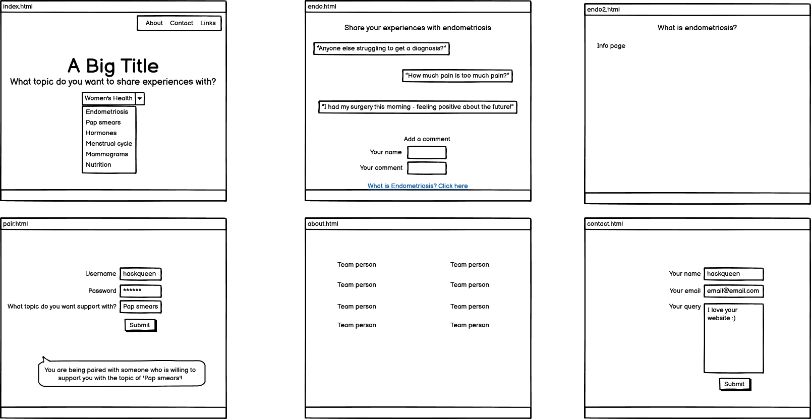
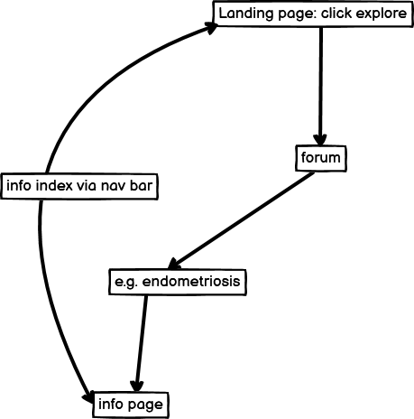

# Women's Health April Hybrid Hackathon 

## Introduction

Problem statement:
- As a woman, I find that many aspects of my health, especially sensitive or less-discussed topics, are often overlooked or not openly addressed. This leaves me feeling uninformed and unsupported when facing health challenges that are specific to women. I want a safe, welcoming space where I can find reliable information, connect with others experiencing similar issues, and engage in meaningful discussions about women's health.

ConnectHer is designed to provide an environment where women can share experiences and find information on little discussed female health issues.
Each forum will contain a link to appropriate medical information as well as giving women the opportunity to share anecdotes, personal experiences and advice.

## Judging Criteria
1. The project demonstrates an impact on women's health
- ConnectHer is a focused space where women can share experiences with issues that are often stigmatised. The information pages will be built with creditable information and signposts to appropriate services. The website aims to empower women to take control of their health by connecting with other women and making well-informed choices.

2. The project is realistic and has real world value
- Within the scope of the hackathon, the project is achievable and will give users a functioning forum where advice, anecdotes and experiences can be shared. Information pages will also be available for users to learn more about each issue.
- The scope of the project can extend much wider with a much greater real world value when multiple users engage with the platform. Many more issues that people wish to discuss can be identified and other features could be added such as meet-ups or a buddy system.

3. The project has excellent design and layout 
- Django framework, Bootstrap and CSS were used to create a welcoming and supportive environment which users can easily navigate.

4. The project is presented to the judges in a professional manner
- The presentation will be given by Emma Lamont in-person at the Google offices in London. She has extensive performing and presenting experience through her former career. 

5. The project demonstrates innovation and creativity
- Lack of open communication and stigma is a barrier to women finding the appropriate support in a health setting. The project addresses a need by opening up dialogue into issues such as endometriosis or the menopause. Real women and access to appropriate medical information together innovates a path which leads women to greater health autonomy. 

## The Future

## Design 
- Wireframes:
 

## Tech used
- GitHub
- HTML
- CSS
- BootStrap
- Django

## Credits
- GitHub
- Google Fonts

### Information page references
- (Endometriosis)[https://swhr.org/resources/endometriosis-toolkit-a-patient-empowerment-guide/?gad_source=1] 
- (Menopause)[https://www.who.int/news-room/fact-sheets/detail/menopause]

## The Team
- Stephanie Bell (Front-end) (LinkedIn)[https://www.linkedin.com/in/stephanie-bell-529a362b/] (GitHub)[https://github.com/bpstephanie/]
- Kyle Clow (Scrum master and back-end) (LinkedIn)[https://www.linkedin.com/in/kyle-clow/] (GitHub)[https://github.com/KTC96]
- Emma Lamont (Front-end) (LinkedIn)[https://www.linkedin.com/in/emma-lamont] (GitHub)[https://github.com/elamont174]
- Stefan Ruppe (Front-end) (LinkedIn)[https://www.linkedin.com/in/stefan-ruppe/] (GitHub)[https://github.com/CsClown/]
- Ash Selvaraj (Front-end) (LinkedIn) [https://www.linkedin.com/in/ashwinkarthik-selvaraj-12882751/] (GitHub)[https://github.com/ashwinsel] 
- ib LinkedIn: GitHub: